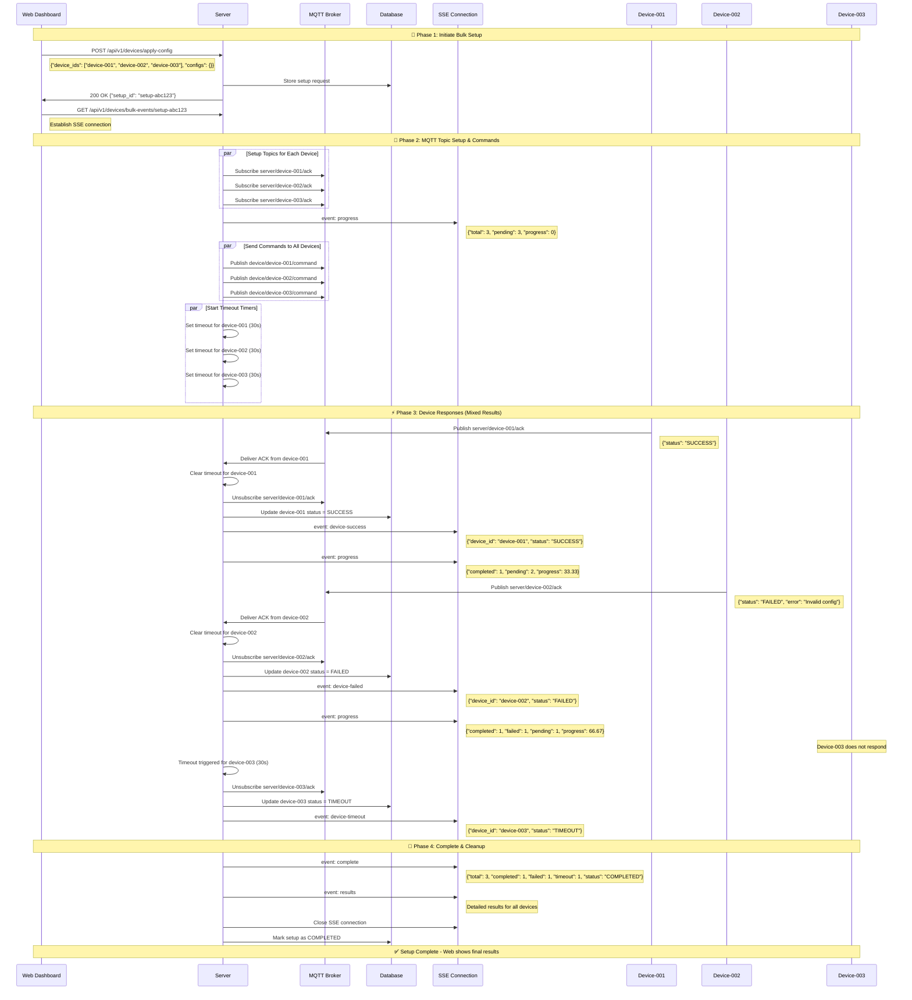

# 📡 Communication System - Client ↔ Server ↔ Devices

## 📋 Overview

ระบบ read สำหรับการสื่อสารระหว่าง client, server และ devices เพื่อติดตามสถานะการอ่านข้อความและการตอบสนอง

---

## 🔄 Communication Flow
##  Command Verity
```
SECRET_KEY = modernchabackdoor
x-signature: SHA256( payload (raw JSON bytes) + SECRET_KEY)
example payload = {"chip_id":"24AB3C91","mac_address":"24:6F:28:AB:3C:91","firmware_version":"car_wash_v1.00"}

📤 HTTP Request
POST Endpoint (example /api/v1/devices/need-register)
HTTP Header (x-signature: SHA256( payload (raw JSON bytes) + SECRET_KEY))

📤 MQTT massage 
add "sha256" at bottom of payload 
example 
{
  "chip_id": "24AB3C91",
  "mac_address": "24:6F:28:AB:3C:91",
  "firmware_version": "car_wash_v1.00"
  "sha256": SHA256( {"chip_id":"24AB3C91","mac_address":"24:6F:28:AB:3C:91","firmware_version":"car_wash_v1.00"} + SECRET_KEY)
}
```


### 🔗 Register New Device

> **📝 Description:** ใช้ HTTP เมื่อกดปุ่ม Mode Paring บน Device  
> **🎯 Purpose:** Device Send http request -> server เพื่อให้ได้มาซึ่ง `pin` จะได้ระบุ device ที่แสดงบน web ได้

#### 📤 Request

```http
POST /api/v1/devices/need-register
x-signature: SHA256( payload (raw JSON bytes) + SECRET_KEY )
```

**Body Payload:**

```json

{
  "chip_id": "24AB3C91",
  "mac_address": "24:6F:28:AB:3C:91",
  "firmware_version": "car_wash_v1.00"
}
```

#### 📥 Response

**✅ Success (200):**

```json
{
  "success": true,
  "data": {
    "pin": "1150",
    "device_id": "string"
  },
  "message": "Device registered successfully"
}
```

**❌ Failed (400):**

```json
{
  "success": false,
  "errorCode": "errorCode",
  "message": "message",
  "statusCode": 400,
  "timestamp": "2025-09-23T18:25:09.870Z",
  "path": "path"
}
```
---
### 🔄 Sync Device start up and shutdown

> **📝 Description:** ใช้ HTTP เพื่อ sync device status and configurations  
> **🎯 Purpose:** Device ส่ง configs ปัจจุบันไปยัง server เพื่อ synchronize การตั้งค่า

```json
**📝 CAR WASH startup Examples:**
{
  "topic_request" : "startup", // startup/shutdown
  "device_id": "Device-001",
  "device_status" : "NORMAL",
  "payload": {
    "configs": {
      "machine":{
        "ACTIVE": true,
        "BANKNOTE": true,
        "COIN": true,
        "QR": true,
        "ON_TIME": "8:00",
        "OFF_TIME": "16:00",
        "SAVE_STATE" : true
      },
      "function": {
          "sec_per_baht": {
            "HP_WATER": 10,
            "FOAM": 10,
            "AIR": 10,
            "WATER": 10,
            "VACUUM": 10,
            "BLACK_TIRE": 10,
            "WAX": 10,
            "AIR_FRESHENER": 0,
            "PARKING_FEE":600
          }
    }
  }
  },
  "timestamp": 1758358335794
}
```
```json
**📝 Helmet dryer startup Examples:**
{
  "topic_request" : "startup", // startup/shutdown
  "device_id": "Device-001",
  "device_status" : "NORMAL",
  "payload": {
    "configs": {
      "machine":{
        "ACTIVE": true,
        "BANKNOTE": true,
        "COIN": true,
        "QR": true,
        "ON_TIME": "8:00",
        "OFF_TIME": "16:00",
        "SAVE_STATE" : true
      },
      "pricing": {
          "BASE_FEE": 30,
          "PROMOTION": 0,
          "WORK_PERIOD" : 600
        },
      "function_start": {
            "DUST_BLOW": 0,
            "SANITIZE": 50,
            "UV": 100,
            "OZONE": 200,
            "DRY_BLOW": 300,
            "PERFUME": 400
        },
      "function_end": {
            "DUST_BLOW": 50,
            "SANITIZE": 100,
            "UV": 200,
            "OZONE": 300,
            "DRY_BLOW": 400,
            "PERFUME": 600
        }
    }
  },
  "timestamp": 1758358335794
}
```

---

### 🔄 Sync Device Configs

> **📝 Description:** ใช้ HTTP เพื่อ sync device configurations  
> **🎯 Purpose:** Device ส่ง configs ปัจจุบันไปยัง server เพื่อ synchronize การตั้งค่า

#### 📤 Request

```http
POST /api/v1/device/sync-configs/{device_id}
x-signature: {CHECK_SUM_FROM_MAC_ADDRESS_AND_PAYLOAD_STRING}
```

**Body Payload:**

```json
{
  ["key"]: "value"
}
```

#### 📥 Response

**✅ Success (200):**

```json
{
  "success": true,
  "message": "Device configs synced successfully"
}
```

**❌ Failed (400):**

```json
{
  "success": false,
  "errorCode": "errorCode",
  "message": "message",
  "statusCode": 400,
  "timestamp": "2025-09-25T10:30:00Z",
  "path": "path"
}
```

---

### 💳 Device QR Code Payment

> **📝 Description:** ใช้ HTTP REQUEST / MQTT Device  
> **🎯 Purpose:** Device Send http request -> server เพื่อนำ response `chargeId` ไปไว้ listen ใน MQTT

#### 📤 Payment Request

```http
POST /api/v1/payment-gateway/payments
x-signature: {CHECK_SUM_FROM_MAC_ADDRESS_AND_PAYLOAD_STRING}
```

**Body Payload:**

```json
{
  "device_id": "device-0004",
  "amount": 100, // 1.00 [บาท]
  "payment_method": "QR_PROMPT_PAY",
  "description": "Car wash payment"
}
```

#### 📥 Payment Response

**✅ Success (200):**

```json
{
  "success": true,
  "data": {
    "id": "cmfwv9cqw0001u20olfjb9nyx",
    "device_id": "device-0004",
    "amount": {
      "s": 1,
      "e": 0,
      "d": [1]
    },
    "payment_method": "QR_PROMPT_PAY",
    "reference_id": "CCW-1758650767283-JY1R54",
    "status": "PENDING",
    "payment_results": {
      "chargeId": "ch_336wKuViqvVwHGx3GUj5Us5JTjk",
      "redirect": null,
      "encodedImage": {
        "expiry": "2025-09-24 01:36:08",
        "rawData": "00020101021230530016A00000067701011201150105562181354030210CATCARWASH530376454041.005802TH6220071625092401060816266304B1D4" // เอาไป Generate QR CODE
      },
      "actionRequired": "ENCODED_IMAGE",
      "paymentMethodType": "QR_PROMPT_PAY"
    },
    "created_at": "2025-09-24 01:06:07",
    "updated_at": "2025-09-24 01:06:08"
  },
  "message": "Payment created successfully"
}
```

**❌ Failed (400):**

```json
{
  "success": false,
  "errorCode": "errorCode",
  "message": "message",
  "statusCode": 400,
  "timestamp": "2025-09-23T18:25:09.870Z",
  "path": "path"
}
```

#### 🔔 MQTT Payment Status

> **📡 Topic:** `device/{chargeId}/payment-status`  
> **📝 Description:** เอา `chargeId` มา listen MQTT จาก server เพื่อรอ confirm จ่ายเงิน

**✅ MQTT Success:**

```sh
{
  "command_id": "cmd-payment-001",
  "command": "PAYMENT",
  "payload": {
    "chargeId": "ch_336wKuViqvVwHGx3GUj5Us5JTjk",
    "status": "PENDING" // PENDING" | "SUCCEEDED" | "FAILED" | "CANCELLED
  },
  "timestamp": 1758358335794,
  "sha256": SHA256( {"chip_id":"24AB3C91","mac_address":"24:6F:28:AB:3C:91","firmware_version":"car_wash_v1.00"} + SECRET_KEY)
}
```

#### ⏰ Timeout Fallback

> **📝 Description:** ถ้า Timeout ยังไม่ได้รับ MQTT จาก Server Device ไปถามเองผ่าน HTTP REQUEST

```http
GET /api/v1/payment-gateway/payments/{chargeId}/status
x-signature: {CHECK_SUM_FROM_MAC_ADDRESS_AND_PAYLOAD_STRING}
```

**✅ Success:**

```json
{
  "success": true,
  "data": {
    "chargeId": "ch_336wKuViqvVwHGx3GUj5Us5JTjk",
    "status": "PENDING" // PENDING" | "SUCCEEDED" | "FAILED" | "CANCELLED
  },
  "message": "Payment status checked successfully"
}
```

**❌ Failed:**

```json
{
  "success": false,
  "errorCode": "errorCode",
  "message": "message",
  "statusCode": 400,
  "timestamp": "2025-09-23T18:25:09.870Z",
  "path": "path"
}
```

> **⚠️ Note:** Topic ควรหยุดหลังจากได้รับ Destroy หลังจากได้รับการ confirm แล้ว

---

### 📊 Device State Streaming [60s]

> **📡 Topic:** `server/{device_id}/streaming`  
> **📝 Description:** Device streaming state ผ่าน MQTT

**Payload:**

```json
{
  "rssi": -76,
  "status": "NORMAL", // "NORMAL" | "ERROR" | "OFFLINE"
  "uptime": 39623, // นาที
  "timestamp": 1758358335794
}
```

---

### 📝 Logs Event Upload

> **📝 Description:** Device upload logs ผ่าน http request เมื่อ device reset && has logs

#### 📤 Upload Request

```http
POST /api/v1/device-event-logs/uploads
x-signature: {CHECK_SUM_FROM_MAC_ADDRESS_AND_PAYLOAD_STRING}
```

**Body Payload:**

```json
{
  "device_id": "Device-001",
  "items": [
    {
      "qr": {
        "chargeId": "ACB-1152-1152",
        "net_amount": 0
      },
      "bank": {
        "20": 0,
        "50": 0,
        "100": 0,
        "500": 0,
        "1000": 0
      },
      "coin": {
        "1": 5,
        "2": 0,
        "5": 0,
        "10": 0
      },
      "type": "PAYMENT",
      "status": "SUCCEEDED", // PENDING" | "SUCCEEDED" | "FAILED" | "CANCELLED
      "timestamp": 1760634265248,
      "total_amount": 5
    }
  ]
}
```

#### 📥 Upload Response

**✅ Success (201):**

```json
{
  "success": true,
  "data": {
    "length": 1
  },
  "message": "Logs uploaded successfully"
}
```

**❌ Failed (400):**

```json
{
  "success": false,
  "errorCode": "errorCode",
  "message": "message",
  "statusCode": 400,
  "timestamp": "2025-09-23T18:25:09.870Z",
  "path": "path"
}
```

---

### ⚙️ Device Setup via Web Interface

> **📝 Description:** การ setup device parameters ผ่าน web interface โดยใช้ MQTT/HTTP  
> **🎯 Purpose:** ให้ผู้ดูแลระบบสามารถ configure หลาย devices พร้อมกันได้

#### 🌐 Web → Server: Apply Config to Multiple Devices

```http
POST /api/v1/devices/apply-config
Authorization: Bearer {jwt_token}
Content-Type: application/json
```

**Body Payload:**

```json
{
  "device_ids": ["device-0001", "device-0002", "device-0003"],
  "configs": {}
}
```

**✅ Success Response (200):**

```json
{
  "success": true,
  "data": {
    "setup_id": "setup-cmfwv9cqw0001u20olfjb9nyx",
    "device_ids": ["device-0001", "device-0002", "device-0003"],
    "total_devices": 3,
    "status": "INITIATED"
  },
  "message": "Config apply initiated successfully"
}
```

#### 📡 Server → Device: MQTT Command

> **📡 Topic:** `device/{device_id}/command`  
> **📝 Description:** Server ส่ง command ใดๆ ไปให้ device

**MQTT Command Payload:**

```json
**📝 CAR WASH Command Examples:**
{
  "command_id": "cmd-cmfwv9cqw0001u20olfjb9nyx",
  "command": "APPLY_CONFIG",
  "require_ack": true,
  "payload": {
    "configs": {
      "machine":{
        "ACTIVE": true,
        "BANKNOTE": true,
        "COIN": true,
        "QR": true,
        "ON_TIME": "8:00",
        "OFF_TIME": "16:00",
        "SAVE_STATE" : true
      },
      "function": {
          "sec_per_baht": {
            "HP_WATER": 10,
            "FOAM": 10,
            "AIR": 10,
            "WATER": 10,
            "VACUUM": 10,
            "BLACK_TIRE": 10,
            "WAX": 10,
            "AIR_FRESHENER": 0,
            "PARKING_FEE":600
          }
    }
  }
  },
  "timestamp": 1758358335794
}
```
```json
**📝 Helmet dryer Command Examples:**
{
  "command_id": "cmd-cmfwv9cqw0001u20olfjb9nyx",
  "command": "APPLY_CONFIG",
  "require_ack": true,
  "payload": {
    "configs": {
      "machine":{
        "ACTIVE": true,
        "BANKNOTE": true,
        "COIN": true,
        "QR": true,
        "ON_TIME": "8:00",
        "OFF_TIME": "16:00",
        "SAVE_STATE" : true
      },
      "pricing": {
          "BASE_FEE": 30,
          "PROMOTION": 0,
          "WORK_PERIOD" : 600
        },
      "function_start": {
            "DUST_BLOW": 0,
            "SANITIZE": 50,
            "UV": 100,
            "OZONE": 200,
            "DRY_BLOW": 300,
            "PERFUME": 400
        },
      "function_end": {
            "DUST_BLOW": 50,
            "SANITIZE": 100,
            "UV": 200,
            "OZONE": 300,
            "DRY_BLOW": 400,
            "PERFUME": 600
        }
    }
  },
  "timestamp": 1758358335794
}
```

**📝 Command Examples:**

**🔄 Command with ACK:**
```json
{
  "command_id": "cmd-restart-001",
  "command": "RESTART",
  "require_ack": true,
  "payload": {
    "delay_seconds": 5
  },
  "timestamp": 1758358335794
}
```
```json
{
  "command_id": "cmd-update-001",
  "command": "UPDATE_FIRMWARE",
  "require_ack": true,
  "payload": {
    "url": "https://example.com/firmware/esp32-v1.2.3.bin",
    "version": "1.2.3",
    "sha256": "3f5a8f1b...<HEX 64 ตัว>...c9d1e0ab",   // ตรวจสอบกับไฟล์จริง
    "size": 972800,                               // ไบต์ (ทราบได้ล่วงหน้า หรือปล่อยว่างกรณี chunked)
    "reboot_after": true,                         // รีบูตหลังแฟลชสำเร็จ
    "timeout_sec": 120,                           // กันค้าง
  },
  "timestamp": 1758358335794
}

```
```json
{
  "command_id": "cmd-reset-001",
  "command": "RESET_CONFIG",
  "require_ack": true,
  "payload": {
    "delay_seconds": 30
  },
  "timestamp": 1758358335794
}
```

**⚡ Command without ACK (Fire and Forget):**
```json
{
  "command_id": "cmd-ping-001",
  "command": "PING",
  "require_ack": false,
  "payload": {},
  "timestamp": 1758358335794
}
```
```json
{
  "command_id": "cmd-ping-001",
  "command": "GET_STATUS",
  "require_ack": false,
  "payload": {
    "status" : "NORMAL" // ERROR" | "OFFLINE" | "MACHINE_OFF"
  },
  "timestamp": 1758358335794
}
```

**Command Types:**

**🔄 Commands with ACK Required:**
- `APPLY_CONFIG` - Apply configuration (ต้อง ACK)
- `RESTART` - Restart device (ต้อง ACK)
- `UPDATE_FIRMWARE` - Update firmware (ต้อง ACK)
- `RESET_CONFIG` - Reset to default config (ต้อง ACK)

**⚡ Commands without ACK (Fire and Forget):**
- `PING` - PING device (ไม่ต้อง ACK)
- `GET_STATUS` (Example ยังคิดไม่ออก)- Get device status (ไม่ต้อง ACK)

#### 📡 Device → Server: MQTT ACK Response

> **📡 Topic:** `server/{device_id}/ack`  
> **📝 Description:** Device ตอบกลับผล command ใดๆ

**✅ MQTT Success ACK:**

```json
**✅ MQTT Success ACK for APPLY_CONFIG / RESTART/ RESET_CONFIG :**
{
  "command_id": "cmd-cmfwv9cqw0001u20olfjb9nyx",
  "device_id": "device-0001",
  "command": "APPLY_CONFIG",
  "status": "SUCCESS",
  "timestamp": 1758358355794
}
```
```json
**✅ MQTT Success ACK for UPDATE_FIRMWARE :**
{
  "command_id": "cmd-cmfwv9cqw0001u20olfjb9nyx",
  "device_id": "device-0001",
  "command": "UPDATE_FIRMWARE",
  "status": "ERROR / PROGRESS / SUCCESS",
  "new_version" :"car_wash_v1.2.0",
  "timestamp": 1758358355794
}
```

**❌ MQTT Failed ACK:**

```json
{
  "command_id": "cmd-cmfwv9cqw0001u20olfjb9nyx",
  "device_id": "device-0001",
  "command": "APPLY_CONFIG",
  "status": "FAILED",
  "error": "Config validation failed",
  "timestamp": 1758358355794
}
```

**⏰ Server Timeout Handling:**
- หาก device ไม่ตอบ ACK ภายใน 30 วินาที
- Server จะ mark status เป็น `TIMEOUT`
- ส่ง SSE event ไปยัง web: `{"status": "TIMEOUT", "error": "Device did not respond"}`

#### 🔧 MQTT Topic Lifecycle Management

**📋 Topic Creation Strategy:**
- **Dynamic Topics**: สร้าง topic เมื่อมี command request
- **ACK Commands**: สร้าง ACK topic เฉพาะ commands ที่ `require_ack: true`
- **Fire and Forget**: ไม่สร้าง ACK topic สำหรับ commands ที่ `require_ack: false`
- **Auto Cleanup**: ทำลาย topic หลังจาก command เสร็จสิ้น
- **Timeout Cleanup**: ทำลาย topic หลังจาก timeout (30 วินาที) เฉพาะ ACK commands

**🔄 Topic Lifecycle Flow:**

1. **Topic Creation** (เมื่อมี command request):
```
Server creates subscription: server/{device_id}/ack
Server publishes to: device/{device_id}/command
```

2. **Active Monitoring** (รอ ACK):
```
Server listens on: server/{device_id}/ack
Timeout: 30 seconds
```

3. **Topic Cleanup** (เมื่อได้รับ ACK หรือ timeout):
```
Server unsubscribes from: server/{device_id}/ack
Topic automatically cleaned by MQTT broker
```

**💡 Implementation Pattern:**

```javascript
// Pseudo code
async function sendCommand(deviceId, command) {
  const commandId = generateCommandId();
  const requireAck = command.require_ack;
  
  // 1. Create topic subscription (only for ACK commands)
  if (requireAck) {
    await mqttClient.subscribe(`server/${deviceId}/ack`);
    
    // 2. Set timeout cleanup (only for ACK commands)
    const timeout = setTimeout(() => {
      mqttClient.unsubscribe(`server/${deviceId}/ack`);
      markAsTimeout(commandId);
      sendSSEEvent('device-timeout', {device_id: deviceId, command_id: commandId});
    }, 30000);
  }
  
  // 3. Send command
  await mqttClient.publish(`device/${deviceId}/command`, {
    command_id: commandId,
    command: command.type,
    require_ack: requireAck,
    payload: command.payload
  });
  
  // 4. Handle ACK (only for ACK commands)
  if (requireAck) {
    mqttClient.on('message', (topic, message) => {
      if (topic === `server/${deviceId}/ack`) {
        clearTimeout(timeout);
        mqttClient.unsubscribe(`server/${deviceId}/ack`);
        processAck(message);
        sendSSEEvent('device-success', message);
      }
    });
  } else {
    // Fire and forget - mark as sent immediately
    markAsSent(commandId);
    sendSSEEvent('command-sent', {device_id: deviceId, command_id: commandId});
  }
}
```

**🔄 Command Flow Examples:**

**Example 1: ACK Command (APPLY_CONFIG)**
```
1. Server subscribes to server/device-001/ack
2. Server publishes to device/device-001/command (require_ack: true)
3. Server waits for ACK with 30s timeout
4. Device responds via server/device-001/ack
5. Server cleans up topic immediately
```

**Example 2: Fire-and-Forget Command (PING)**
```
1. Server publishes to device/device-001/command (require_ack: false)
2. No ACK topic created
3. No timeout set
4. Command marked as sent immediately
5. No cleanup needed
```

**🧹 Cleanup Rules:**
- **ACK Commands**: ทำลาย topic ทันทีหลัง ACK หรือ timeout (30s)
- **Fire-and-Forget Commands**: ไม่มี topic ที่ต้อง cleanup
- **Bulk Commands**: ทำลายทุก ACK topic เมื่อ bulk operation เสร็จ
- **Server Restart**: Re-create active ACK topics จาก database

**⚡ Performance Benefits:**
- **Memory Efficient**: ไม่เก็บ topic ที่ไม่ใช้
- **Network Efficient**: ลด MQTT broker load
- **Scalable**: รองรับ device จำนวนมาก
- **Clean**: ไม่มี topic zombie

**🚨 Edge Cases:**
- **Duplicate ACK**: Ignore หลังจาก cleanup แล้ว
- **Late ACK**: Ignore หลังจาก timeout
- **Server Crash**: Cleanup orphaned topics on restart
- **Network Issues**: Auto-cleanup ป้องกัน topic leak

#### 🔄 Complete Device Setup Flow



#### 📊 Flow Summary

**🚀 Phase 1: Initiation**
1. Web sends bulk config request
2. Server creates setup_id and stores in DB
3. Web establishes SSE connection

**📡 Phase 2: MQTT Setup**
1. Server subscribes to ACK topics for all devices
2. Server publishes commands to all devices
3. Server starts timeout timers (30s each)

**⚡ Phase 3: Device Responses**
1. **Device-001**: Responds SUCCESS → immediate cleanup
2. **Device-002**: Responds FAILED → immediate cleanup  
3. **Device-003**: No response → timeout cleanup

**🏁 Phase 4: Completion**
1. All devices processed (success/failed/timeout)
2. Send final results via SSE
3. Close connections and cleanup

**🎯 Key Features:**
- **Parallel Processing**: Handle multiple devices simultaneously
- **Real-time Updates**: SSE events for each device response
- **Automatic Cleanup**: MQTT topics cleaned immediately after ACK/timeout
- **Mixed Results**: Support partial success scenarios
- **Timeout Handling**: 30-second timeout per device

#### 📡 Server → Web: SSE Real-time Updates

> **📡 Endpoint:** `GET /api/v1/devices/command-events/{command_id}`  
> **📝 Description:** Server ส่งผลการ command ใดๆ แต่ละ device ไปให้ web ผ่าน SSE

```http
GET /api/v1/devices/command-events/{command_id}
Authorization: Bearer {jwt_token}
Accept: text/event-stream
```

**Alternative Endpoints:**
- `GET /api/v1/devices/events/{command_id}` - สำหรับ command ทั่วไป
- `GET /api/v1/devices/bulk-events/{setup_id}` - สำหรับ bulk operations (เมื่อส่ง command ไปหลาย devices พร้อมกัน)

**📝 Note:** 
- `command_id` = ID ของ command เดี่ยวที่ส่งไปยัง device หนึ่งตัว
- `setup_id` = ID ของ bulk operation ที่ส่ง command เดียวกันไปยังหลาย devices

**💡 Usage Examples:**

**Example 1: Bulk Config Apply**
```http
POST /api/v1/devices/apply-config
{
  "device_ids": ["device-001", "device-002", "device-003"],
  "configs": {"wash_time": 300, "soap_amount": 50}
}
```
Response: `{"setup_id": "setup-config-abc123"}`

SSE Endpoint: `GET /api/v1/devices/bulk-events/setup-config-abc123`

**Example 2: Bulk Device Restart**
```http
POST /api/v1/devices/bulk-restart
{
  "device_ids": ["device-001", "device-002"]
}
```
Response: `{"setup_id": "restart-xyz789"}`

SSE Endpoint: `GET /api/v1/devices/bulk-events/restart-xyz789`

**Example 3: Single Device Command**
```http
POST /api/v1/devices/device-001/restart
```
Response: `{"command_id": "cmd-restart-single-001"}`

SSE Endpoint: `GET /api/v1/devices/events/cmd-restart-single-001`

**📡 SSE Event Types:**

**✅ Device Success Event:**
```
event: device-success
data: {"device_id": "device-0001", "command_id": "cmd-cmfwv9cqw0001u20olfjb9nyx", "command": "APPLY_CONFIG", "status": "SUCCESS", "timestamp": 1758358355794}
```

**❌ Device Failed Event:**
```
event: device-failed
data: {"device_id": "device-0002", "command_id": "cmd-cmfwv9cqw0001u20olfjb9nyx", "command": "APPLY_CONFIG", "status": "FAILED", "error": "Config validation failed", "timestamp": 1758358355794}
```

**⏰ Device Timeout Event:**
```
event: device-timeout
data: {"device_id": "device-0003", "command_id": "cmd-cmfwv9cqw0001u20olfjb9nyx", "command": "APPLY_CONFIG", "status": "TIMEOUT", "error": "Device did not respond", "timestamp": 1758358385794}
```

**📊 Progress Update Event:**
```
event: progress
data: {"command_id": "cmd-cmfwv9cqw0001u20olfjb9nyx", "command": "APPLY_CONFIG", "total": 3, "completed": 1, "failed": 1, "timeout": 1, "pending": 0, "progress": 100}
```

**🏁 Command Complete Event:**
```
event: complete
data: {"command_id": "cmd-cmfwv9cqw0001u20olfjb9nyx", "command": "APPLY_CONFIG", "total": 3, "completed": 1, "failed": 1, "timeout": 1, "status": "COMPLETED", "timestamp": 1758358400794}
```

**📋 Detailed Results Event:**
```
event: results
data: {
  "command_id": "cmd-cmfwv9cqw0001u20olfjb9nyx",
  "command": "APPLY_CONFIG",
  "results": [
    {"device_id": "device-0001", "status": "SUCCESS", "timestamp": 1758358355794},
    {"device_id": "device-0002", "status": "FAILED", "error": "Config validation failed", "timestamp": 1758358365794},
    {"device_id": "device-0003", "status": "TIMEOUT", "error": "Device did not respond", "timestamp": 1758358385794}
  ]
}
```

**🔄 Real SSE Event Examples:**

**Example 1: Bulk Config Apply Events**
```
# เมื่อเริ่มต้น
event: progress
data: {"command_id": "setup-config-abc123", "command": "APPLY_CONFIG", "total": 3, "completed": 0, "failed": 0, "timeout": 0, "pending": 3, "progress": 0}

# Device 1 สำเร็จ
event: device-success
data: {"device_id": "device-001", "command_id": "setup-config-abc123", "command": "APPLY_CONFIG", "status": "SUCCESS", "timestamp": 1758358355794}

# Device 2 ล้มเหลว
event: device-failed
data: {"device_id": "device-002", "command_id": "setup-config-abc123", "command": "APPLY_CONFIG", "status": "FAILED", "error": "Invalid config format", "timestamp": 1758358365794}

# Device 3 timeout
event: device-timeout
data: {"device_id": "device-003", "command_id": "setup-config-abc123", "command": "APPLY_CONFIG", "status": "TIMEOUT", "error": "Device did not respond", "timestamp": 1758358385794}

# สรุปผล
event: complete
data: {"command_id": "setup-config-abc123", "command": "APPLY_CONFIG", "total": 3, "completed": 1, "failed": 1, "timeout": 1, "status": "COMPLETED", "timestamp": 1758358400794}
```

**Example 2: Bulk Restart Events**
```
# Device 1 restart สำเร็จ
event: device-success
data: {"device_id": "device-001", "command_id": "restart-xyz789", "command": "RESTART", "status": "SUCCESS", "timestamp": 1758358355794}

# Device 2 restart สำเร็จ
event: device-success
data: {"device_id": "device-002", "command_id": "restart-xyz789", "command": "RESTART", "status": "SUCCESS", "timestamp": 1758358360794}

# สรุปผล
event: complete
data: {"command_id": "restart-xyz789", "command": "RESTART", "total": 2, "completed": 2, "failed": 0, "timeout": 0, "status": "COMPLETED", "timestamp": 1758358365794}
```

**Example 3: Single Device Command**
```
# Single device restart
event: device-success
data: {"device_id": "device-001", "command_id": "cmd-restart-single-001", "command": "RESTART", "status": "SUCCESS", "timestamp": 1758358355794}
```


---

### 🛡️ CHECK_SUM_FROM_MAC_ADDRESS

- ให้นำ body payload มาแปลงเป็น string (เช่น JSON.stringify)
- จากนั้นนำ string นี้ไปเข้ารหัส (เช่น hash ด้วย HMAC หรือ SHA256 โดยใช้ secret key ที่กำหนด)
- นำผลลัพธ์ที่ได้ (checksum หรือ signature) ไปใส่ใน header `x-signature`

ตัวอย่างขั้นตอน:

1. `const payloadString = JSON.stringify(bodyPayload);`
2. `const signature = hashFunction(payloadString, secretKey);`
3. ส่ง header: `x-signature: signature`


