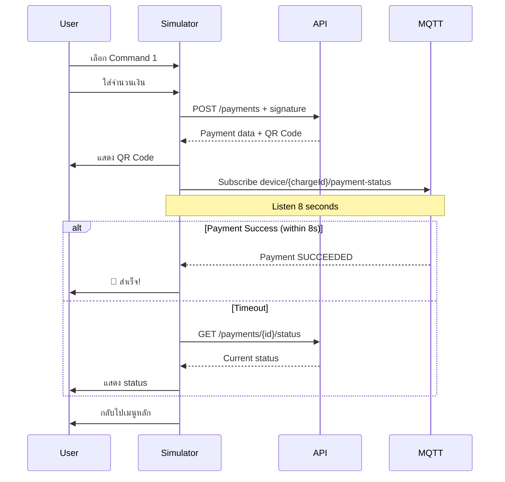

# 💳 Payment Device Simulator

Simulator สำหรับจำลองการจ่ายเงินผ่าน QR Code Payment บน CatCar Wash Service

## 🚀 Features

- ✅ สร้าง payment request พร้อม signature verification
- ✅ **แสดง QR Code ใน terminal** สำหรับสแกนจ่ายเงิน
- ✅ **Auto Listen MQTT** พร้อม timeout 8 วินาที
- ✅ **Fallback HTTP** เมื่อ MQTT timeout
- ✅ รองรับ payment workflow ครบถ้วนตาม PLAN-COMUNICATION.md

## 📦 Installation

```bash
cd catcar_api_client

# ติดตั้ง dependencies
pip install -r requirements.txt
```

### Dependencies:
- `requests` - สำหรับ HTTP requests
- `paho-mqtt` - สำหรับ MQTT communication
- `pyyaml` - สำหรับ config files
- `qrcode` - **สำหรับแสดง QR Code ใน terminal**

## 🎯 Quick Start

```bash
python payment_device_simulator.py
```

### Initial Setup:
```
Device ID: device-0004
API Base URL: http://localhost:3000/api/v1
MQTT Broker: localhost
MQTT Port: 1883
```

## 📋 Menu Commands

### 1. 💰 Create Payment [QR + Auto Listen 8s] - แนะนำ! 🌟

**การทำงาน:**
1. สร้าง payment request พร้อม signature
2. **แสดง QR Code ใน terminal**
3. เชื่อมต่อ MQTT broker (ถ้ายังไม่ได้เชื่อม)
4. Listen payment status อัตโนมัติ (timeout 8 วินาที)
5. ถ้า timeout → Fallback ไป HTTP GET status
6. จบ session และกลับไปเมนูหลัก

**ตัวอย่างการใช้งาน:**
```
👉 เลือกคำสั่ง (1-9): 1
💵 จำนวนเงิน (บาท): 1
📝 คำอธิบาย (default: Car wash payment): [Enter]
💳 Payment Method: 1

📡 กำลังส่ง payment request...
✅ สร้าง payment สำเร็จ!

📱 QR CODE - สแกนเพื่อชำระเงิน
============================================================
█████████████████████████████████
█████████████████████████████████
████ ▄▄▄▄▄ █▀ █▀▀██ ▄▄▄▄▄ ████
████ █   █ █▀ ▄ ▄██ █   █ ████
████ █▄▄▄█ ██▀▀ ▀▀█ █▄▄▄█ ████
...
============================================================

🔄 Auto listening payment status...
⏳ กำลังรอ payment status... (เหลือ 8 วินาที)

✅ Payment SUCCEEDED
🎉 การชำระเงินสำเร็จ!
✅ Payment session จบแล้ว
```

### 2. 📡 Listen Payment Status (MQTT)

รอรับ payment status จาก MQTT topic (manual mode)

### 3. 🔍 Check Payment Status (HTTP)

ตรวจสอบ payment status ผ่าน HTTP GET request

### 4. 🔄 Create & Listen (Custom)

สร้าง payment และ listen status แบบกำหนด timeout เอง

### 5. 📊 View Last Payment

ดูข้อมูล payment ล่าสุดที่สร้าง

### 6. 🔗 Connect MQTT

เชื่อมต่อ MQTT broker (manual)

### 7. 🔌 Disconnect MQTT

ตัดการเชื่อมต่อ MQTT broker

### 8. ⚙️ Change Settings

เปลี่ยนการตั้งค่า (ต้อง restart program)

### 9. ❌ Exit

ออกจากโปรแกรม

---

## 🔐 Security Features

### Signature Calculation

```python
SECRET_KEY = "modernchabackdoor"

# HTTP Request
payload = {
    "device_id": "device-0004",
    "amount": 100,
    "payment_method": "QR_PROMPT_PAY",
    "description": "Car wash payment"
}

payload_string = json.dumps(payload, separators=(',', ':'))
signature = SHA256(payload_string + SECRET_KEY)

headers = {
    'x-signature': signature
}
```

### MQTT Message Verification

```python
# MQTT Message
{
    "command_id": "cmd-payment-001",
    "command": "PAYMENT",
    "payload": {
        "chargeId": "ch_xxxxx",
        "status": "SUCCEEDED"
    },
    "timestamp": 1758358335794,
    "sha256": "<calculated_signature>"
}

# Device verifies sha256 field
```

---

## 🔄 Payment Flow

### Option 1: Auto Mode (Command 1) - แนะนำ



### Option 2: Manual Mode (Commands 2-4)

User สามารถควบคุม flow เองได้ทุกขั้นตอน

---

## 📱 QR Code Display

QR Code จะแสดงใน terminal ในรูปแบบ ASCII art:

```
============================================================
📱 QR CODE - สแกนเพื่อชำระเงิน
============================================================
█████████████████████████████████
█████████████████████████████████
████ ▄▄▄▄▄ █▀ █▀▀██ ▄▄▄▄▄ ████
████ █   █ █▀ ▄ ▄██ █   █ ████
████ █▄▄▄█ ██▀▀ ▀▀█ █▄▄▄█ ████
████▄▄▄▄▄▄▄█▄▀ ▀▄█▄▄▄▄▄▄▄████
████ ▄  ▄▄▄ ▀▄▀▄ █▄▄█▄▀▄▀████
████▄ ▀█▄▀▄▀█ ▀▄█▀ ▄ █▄ ▀████
████▀ ▄▀ ▄▄▄█▀▄ ▄██▀ ▄▀█▄████
████▄███▄█▄█ █ ▀█▄▄▄▄▄ █▀████
████ ▄▄▄▄▄ █▄▀  ▄ █ ▄ ▄▄████
████ █   █ █ ▄▀▄▀ ▀▄▄▄▀█▀████
████ █▄▄▄█ █▄▀  ▀▀█ ▄ ▄▄████
████▄▄▄▄▄▄▄█▄▄█▄▄█▄█▄███████
█████████████████████████████████
█████████████████████████████████
============================================================
```

**สแกน QR Code นี้ด้วย mobile banking app เพื่อชำระเงิน!**

---

## ⚡ Performance

- **Auto Listen Timeout**: 8 วินาที (เพียงพอสำหรับการสแกน QR และ confirm)
- **HTTP Fallback**: ใช้เมื่อ MQTT timeout หรือไม่พร้อมใช้งาน
- **Session Management**: จบ session อัตโนมัติหลังได้รับผลลัพธ์

---

## 🔧 Troubleshooting

### QR Code ไม่แสดง

**ปัญหา**: Module qrcode ไม่ติดตั้ง

**แก้ไข**:
```bash
pip install qrcode>=7.4.2
```

### MQTT Connection Failed

**ปัญหา**: ไม่สามารถเชื่อมต่อ MQTT broker

**แก้ไข**:
1. ตรวจสอบว่า MQTT broker ทำงานอยู่
2. ตรวจสอบ port 1883 ว่าเปิดอยู่
3. ตรวจสอบ firewall settings

### Signature Verification Failed

**ปัญหา**: Server ปฏิเสธ request เพราะ signature ไม่ถูกต้อง

**แก้ไข**:
1. ตรวจสอบ SECRET_KEY ว่าตรงกับ server (`modernchabackdoor`)
2. ตรวจสอบ JSON serialization (ไม่มี whitespace)
3. ตรวจสอบ encoding (UTF-8)

### Payment Timeout

**ปัญหา**: ไม่ได้รับ payment status ภายใน 8 วินาที

**แก้ไข**:
- System จะ fallback ไป HTTP GET status อัตโนมัติ
- ถ้าต้องการ timeout ยาวขึ้น ใช้ Command 4 (Custom)

---

## 📝 Example Session

```bash
$ python payment_device_simulator.py

💳 CatCar Wash Service - Payment Device Simulator
============================================================
🆔 Device ID: device-0004
🌐 API Base URL (default: http://localhost:3000/api/v1): 
📡 MQTT Broker (default: localhost): 
🔌 MQTT Port (default: 1883): 

✅ เริ่มต้นโปรแกรมสำเร็จ

============================================================
💳 CatCar Wash Service - Payment Device Simulator
============================================================
🆔 Device ID: device-0004
============================================================
📋 เลือกคำสั่ง:
1. 💰 Create Payment [QR + Auto Listen 8s] - แนะนำ!
2. 📡 Listen Payment Status (MQTT) - รอรับ payment status
3. 🔍 Check Payment Status (HTTP) - ตรวจสอบ payment status
4. 🔄 Create & Listen (Custom) - สร้าง payment แบบกำหนดเอง
5. 📊 View Last Payment - ดูข้อมูล payment ล่าสุด
6. 🔗 Connect MQTT - เชื่อมต่อ MQTT broker
7. 🔌 Disconnect MQTT - ตัดการเชื่อมต่อ MQTT
8. ⚙️  Change Settings - เปลี่ยนการตั้งค่า
9. ❌ Exit - ออกจากโปรแกรม
============================================================
👉 เลือกคำสั่ง (1-9): 1

💰 Create Payment (Auto Listen)
----------------------------------------
🔗 กำลังเชื่อมต่อ MQTT broker: localhost:1883
✅ เชื่อมต่อ MQTT broker สำเร็จ
💵 จำนวนเงิน (บาท): 1.5
📝 คำอธิบาย (default: Car wash payment): 

💳 Payment Method:
1. QR_PROMPT_PAY (default)
👉 เลือก (1): 

🔄 กำลังสร้าง payment...

📡 กำลังส่ง payment request ไปยัง: http://localhost:3000/api/v1/payment-gateway/payments
📋 Device ID: device-0004
💰 Amount: 150 satang (1.50 บาท)
💳 Payment Method: QR_PROMPT_PAY
📝 Description: Car wash payment
🔐 Signature: a1b2c3d4e5f6...
📊 Status Code: 200
✅ สร้าง payment สำเร็จ!

💳 Payment Information:
   Payment ID: cmfwv9cqw0001u20olfjb9nyx
   Charge ID: ch_336wKuViqvVwHGx3GUj5Us5JTjk
   Reference ID: CCW-1758650767283-JY1R54
   Status: PENDING
   Amount: 1.5

📱 QR Code Information:
   Expiry: 2025-10-18 10:36:08
   Raw Data: 00020101021230530016A00000067701011201150...

============================================================
📱 QR CODE - สแกนเพื่อชำระเงิน
============================================================
█████████████████████████████████
█████████████████████████████████
████ ▄▄▄▄▄ █▀ █▀▀██ ▄▄▄▄▄ ████
████ █   █ █▀ ▄ ▄██ █   █ ████
████ █▄▄▄█ ██▀▀ ▀▀█ █▄▄▄█ ████
████▄▄▄▄▄▄▄█▄▀ ▀▄█▄▄▄▄▄▄▄████
████ ▄  ▄▄▄ ▀▄▀▄ █▄▄█▄▀▄▀████
████▄ ▀█▄▀▄▀█ ▀▄█▀ ▄ █▄ ▀████
████▀ ▄▀ ▄▄▄█▀▄ ▄██▀ ▄▀█▄████
████▄███▄█▄█ █ ▀█▄▄▄▄▄ █▀████
████ ▄▄▄▄▄ █▄▀  ▄ █ ▄ ▄▄████
████ █   █ █ ▄▀▄▀ ▀▄▄▄▀█▀████
████ █▄▄▄█ █▄▀  ▀▀█ ▄ ▄▄████
████▄▄▄▄▄▄▄█▄▄█▄▄█▄█▄███████
█████████████████████████████████
█████████████████████████████████
============================================================

🔄 Auto listening payment status...

📡 กำลัง listen payment status จาก MQTT
📋 Topic: device/ch_336wKuViqvVwHGx3GUj5Us5JTjk/payment-status
⏱️  Timeout: 8 วินาที
✅ Subscribe topic สำเร็จ

[10:35:12] 📨 ได้รับ MQTT message จาก topic: device/ch_336wKuViqvVwHGx3GUj5Us5JTjk/payment-status
📋 Payload: {
  "command_id": "cmd-payment-001",
  "command": "PAYMENT",
  "payload": {
    "chargeId": "ch_336wKuViqvVwHGx3GUj5Us5JTjk",
    "status": "SUCCEEDED"
  },
  "timestamp": 1758358335794,
  "sha256": "abc123..."
}
✅ Signature verification สำเร็จ
💳 Payment Status Update:
   Charge ID: ch_336wKuViqvVwHGx3GUj5Us5JTjk
   Status: SUCCEEDED
🏁 Payment SUCCEEDED - หยุด listening

✅ ได้รับ payment status: SUCCEEDED

✅ Payment SUCCEEDED
🎉 การชำระเงินสำเร็จ!

✅ Payment session จบแล้ว

✅ Payment session เสร็จสมบูรณ์

⏸️  กด Enter เพื่อกลับไปเมนูหลัก...
```

---

## 🎯 Use Cases

### 1. Development Testing
ทดสอบ payment flow ระหว่างพัฒนา

### 2. Integration Testing
ทดสอบการเชื่อมต่อระหว่าง device และ server

### 3. QR Code Validation
ตรวจสอบว่า QR code ที่สร้างถูกต้อง

### 4. MQTT Communication Testing
ทดสอบ MQTT message flow และ signature verification

### 5. Performance Testing
วัด response time และ timeout handling

---

## 📚 References

- **PLAN-COMUNICATION.md**: Full payment specification
- **Device Signature Guard**: Server-side signature verification
- **Beam Checkout API**: Payment gateway integration

---

## 🤝 Contributing

หากพบ bug หรือต้องการปรับปรุง กรุณาติดต่อทีมพัฒนา

---

## 📄 License

Internal use only - CatCar Wash Service

