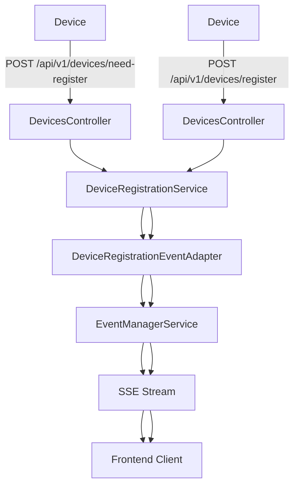
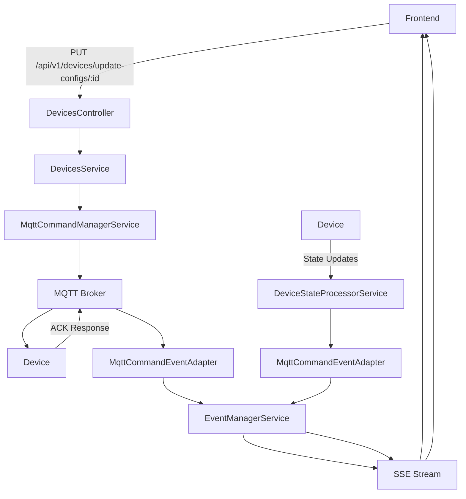

# Services Adapters

โฟลเดอร์นี้ประกอบด้วย services และ adapters ที่ทำหน้าที่เป็นสะพานเชื่อมระหว่าง backend services กับ frontend clients ผ่าน Server-Sent Events (SSE)

## 📁 โครงสร้างไฟล์

```
adepters/
├── device-registration.service.ts          # Service สำหรับจัดการ device registration
├── device-registration-event.adapter.ts    # SSE adapter สำหรับ device registration events
├── mqtt-command-manager.service.ts         # Service สำหรับส่ง MQTT commands ไปยัง devices
├── mqtt-command-event-adepter.ts          # SSE adapter สำหรับ MQTT command events
└── README.md                              # เอกสารนี้
```

## 🔄 Event Flow Architecture

### 1. Device Registration Flow


```mermaid
graph TD
    A[Device] -->|POST /api/v1/devices/need-register| B[DevicesController]
    B --> C[DeviceRegistrationService]
    C --> D[DeviceRegistrationEventAdapter]
    D --> E[EventManagerService]
    E --> F[SSE Stream]
    F --> G[Frontend Client]
    
    H[Device] -->|POST /api/v1/devices/register| I[DevicesController]
    I --> C
    C --> D
    D --> E
    E --> F
    F --> G
```

### 2. MQTT Command Flow


```mermaid
graph TD
    A[Frontend] -->|PUT /api/v1/devices/update-configs/:id| B[DevicesController]
    B --> C[DevicesService]
    C --> D[MqttCommandManagerService]
    D --> E[MQTT Broker]
    E --> F[Device]

    F -->|ACK Response| E
    E --> G[MqttCommandEventAdapter]
    G --> H[EventManagerService]
    H --> I[SSE Stream]
    I --> A

    J[Device] -->|State Updates| K[DeviceStateProcessorService]
    K --> L[MqttCommandEventAdapter]
    L --> H
    H --> I
    I --> A
```

### 3. Config Queue Flow (Background Processing)

เมื่อ device sync config จะใช้ queue เพื่อส่ง config แบบ background พร้อม retry mechanism

```
┌─────────────────────────────────────────────────────────────────────────────┐
│                         CONFIG QUEUE FLOW                                   │
└─────────────────────────────────────────────────────────────────────────────┘

                    ┌──────────────────────┐
                    │   Device Sync Request │
                    │  (syncConfigsById)    │
                    └──────────┬───────────┘
                               │
                               ▼
                    ┌──────────────────────┐
                    │    enqueueConfig()   │
                    └──────────┬───────────┘
                               │
                               ▼
                ┌──────────────────────────────┐
                │ มี device นี้ใน queue แล้ว?    │
                └──────────────┬───────────────┘
                       ┌───────┴───────┐
                       │               │
                      YES              NO
                       │               │
                       ▼               ▼
              ┌─────────────┐   ┌─────────────┐
              │  แทนที่ config │   │  Push ใหม่   │
              │  (deduplicate)│   │  เข้า queue  │
              └─────────────┘   └─────────────┘
                       │               │
                       └───────┬───────┘
                               ▼
┌─────────────────────────────────────────────────────────────────────────────┐
│                                                                             │
│   CONFIG QUEUE                                                              │
│   ┌─────────┬─────────┬─────────┬─────────┬─────────┬─────────┬────────┐   │
│   │ device-1│ device-2│ device-3│ device-4│ device-5│ device-6│  ...   │   │
│   └─────────┴─────────┴─────────┴─────────┴─────────┴─────────┴────────┘   │
│                                                                             │
└─────────────────────────────────────────────────────────────────────────────┘
                               │
                               │  ทุกๆ 1 วินาที (setInterval)
                               ▼
                    ┌──────────────────────┐
                    │  processConfigQueue() │
                    └──────────┬───────────┘
                               │
                               ▼
                    ┌──────────────────────┐
                    │  splice(0, 10)       │
                    │  ตัดออก 10 items     │
                    └──────────┬───────────┘
                               │
                               ▼
┌─────────────────────────────────────────────────────────────────────────────┐
│   BATCH (ตัดออกมา)                                                          │
│   ┌─────────┬─────────┬─────────┐                                           │
│   │ device-1│ device-2│ device-3│  ... (max 10)                             │
│   └─────────┴─────────┴─────────┘                                           │
└─────────────────────────────────────────────────────────────────────────────┘
                               │
                               │  for loop (ทีละ item)
                               ▼
                    ┌──────────────────────┐
                    │  applyConfig()       │
                    │  ส่ง MQTT + รอ ACK    │
                    └──────────┬───────────┘
                               │
                               ▼
                ┌──────────────────────────────┐
                │         ผลลัพธ์?              │
                └──────────────┬───────────────┘
                       ┌───────┼───────┐
                       │       │       │
                    SUCCESS  TIMEOUT  ERROR
                       │       │       │
                       ▼       ▼       ▼
                    ┌─────┐ ┌─────────────────┐
                    │ Done│ │ attempts < MAX? │
                    └─────┘ └────────┬────────┘
                                ┌────┴────┐
                               YES        NO
                                │         │
                                ▼         ▼
                         ┌──────────┐  ┌──────┐
                         │Push back │  │ Drop │
                         │to queue  │  │ item │
                         │(retry)   │  └──────┘
                         └──────────┘
```

#### Config Queue Settings

```typescript
private readonly CONFIG_QUEUE_MAX_SIZE = 1000;      // จำนวน items สูงสุดใน queue
private readonly CONFIG_PROCESS_INTERVAL_MS = 1000; // ประมวลผลทุก 1 วินาที
private readonly CONFIG_BATCH_SIZE = 10;            // ประมวลผลครั้งละ 10 items
private readonly CONFIG_MAX_RETRIES = 1;            // retry สูงสุด 1 ครั้ง
```

#### Timeline Example

```
Time 0s:  Queue = [D1, D2, D3, D4, D5]
          │
          ▼ processConfigQueue()

Time 0s:  splice(0, 10) → batch = [D1, D2, D3, D4, D5]
          Queue = []  (empty)
          │
          ▼ for loop

Time 0s:  applyConfig(D1) → รอ ACK...
Time 1s:  ACK received → SUCCESS ✓

Time 1s:  applyConfig(D2) → รอ ACK...
Time 16s: TIMEOUT! → attempts=1, push back to retry

Time 16s: applyConfig(D3) → รอ ACK...
Time 17s: ACK received → SUCCESS ✓

          ... (D4, D5)

Time 20s: Queue = [D2]  (retry item)
          │
          ▼ next interval (1s later)

Time 21s: processConfigQueue() → retry D2
```

### 4. MqttCommandManagerService Singleton Pattern

**สำคัญ:** `MqttCommandManagerService` ต้องเป็น **singleton** เพื่อป้องกัน handler ถูก register ซ้ำ

```
┌─────────────────────────────────────────────────────────────────┐
│                    SINGLETON PATTERN                            │
└─────────────────────────────────────────────────────────────────┘

                    ┌─────────────────────────┐
                    │  MqttModule (@Global)   │
                    │  ┌───────────────────┐  │
                    │  │MqttCommandManager │  │  ← เพียง 1 instance
                    │  │Service (singleton)│  │
                    │  └───────────────────┘  │
                    │  onModuleInit() × 1     │  ← register handler 1 ครั้ง
                    └────────────┬────────────┘
                                 │
            ┌────────────────────┼────────────────────┐
            │                    │                    │
            ▼                    ▼                    ▼
  ┌─────────────────┐  ┌─────────────────┐  ┌─────────────────┐
  │ PaymentGateway  │  │ DevicesModule   │  │ DeviceCommands  │
  │ Module          │  │                 │  │ Module          │
  │ (inject)        │  │ (inject)        │  │ (inject)        │
  └─────────────────┘  └─────────────────┘  └─────────────────┘
           │                    │                    │
           └────────────────────┴────────────────────┘
                                │
                                ▼
                    ┌───────────────────────┐
                    │  Same instance used   │
                    │  across all modules   │
                    └───────────────────────┘
```

**ห้าม** provide `MqttCommandManagerService` ซ้ำใน modules อื่น เพราะจะทำให้เกิด multiple instances และ handler ถูก register หลายครั้ง ส่งผลให้ ACK message ถูกประมวลผลซ้ำ

## 🛠️ Services Overview

### DeviceRegistrationService
- **หน้าที่**: จัดการ session สำหรับ device registration
- **Features**:
  - สร้าง registration session พร้อม PIN
  - ตรวจสอบ session expiration
  - จัดการ active sessions
- **Methods**:
  - `createRegistrationSession()` - สร้าง session ใหม่
  - `getSessionByPin()` - ดึง session จาก PIN
  - `completeRegistration()` - เสร็จสิ้นการ registration
  - `getActiveSessions()` - ดึง active sessions ทั้งหมด

### MqttCommandManagerService
- **หน้าที่**: ส่ง MQTT commands ไปยัง devices และรอรับ ACK
- **Features**:
  - ส่ง commands แบบ async พร้อม timeout
  - รอรับ ACK responses
  - จัดการ command retry
  - Track active commands
- **Methods**:
  - `applyConfig()` - ส่ง APPLY_CONFIG command
  - `restartDevice()` - ส่ง RESTART command
  - `updateFirmware()` - ส่ง UPDATE_FIRMWARE command
  - `resetConfig()` - ส่ง RESET_CONFIG command
  - `sendCustomCommand()` - ส่ง custom command

## 🎯 Event Adapters Overview

### DeviceRegistrationEventAdapter
- **หน้าที่**: สร้าง SSE stream สำหรับ device registration events
- **Events**:
  - `registration_requested` - มี device ต้องการ registration
  - `registration_completed` - device registration เสร็จสิ้น
  - `registration_cancelled` - ยกเลิก registration
  - `registration_expired` - registration session หมดอายุ

### MqttCommandEventAdapter
- **หน้าที่**: สร้าง SSE stream สำหรับ MQTT command events
- **Events**:
  - `command_sent` - ส่ง command สำเร็จ
  - `command_success` - device ตอบกลับ ACK สำเร็จ
  - `command_failed` - device ตอบกลับ ACK แต่ command ล้มเหลว
  - `command_timeout` - device ไม่ตอบกลับภายใน timeout
  - `command_error` - เกิด error ในการส่ง command

## 📡 SSE Endpoints

### Device Registration Events
```
GET /api/v1/devices/scan
Content-Type: text/event-stream
```

**Event Types**:
```typescript
// Registration Requested
{
  "type": "registration_requested",
  "data": {
    "pin": "123456",
    "chip_id": "ESP32-001",
    "mac_address": "AA:BB:CC:DD:EE:FF",
    "firmware_version": "1.0.0",
    "created_at": "2024-01-01T10:00:00Z",
    "expires_at": "2024-01-01T10:10:00Z"
  }
}

// Registration Completed
{
  "type": "registration_completed",
  "data": {
    "pin": "123456",
    "chip_id": "ESP32-001",
    "mac_address": "AA:BB:CC:DD:EE:FF",
    "firmware_version": "1.0.0",
    "device_id": "device-123",
    "created_at": "2024-01-01T10:00:00Z",
    "expires_at": "2024-01-01T10:10:00Z"
  }
}
```

### MQTT Command Events
```
GET /api/v1/devices/commands/stream
Content-Type: text/event-stream
Authorization: Bearer <jwt_token>
```

**Event Types**:
```typescript
// Command Sent
{
  "type": "command_sent",
  "data": {
    "command_id": "cmd-1234567890-abc123",
    "device_id": "device-123",
    "command": "APPLY_CONFIG",
    "status": "SENT",
    "timestamp": 1234567890
  }
}

// Command Success
{
  "type": "command_success",
  "data": {
    "command_id": "cmd-1234567890-abc123",
    "device_id": "device-123",
    "command": "APPLY_CONFIG",
    "status": "SUCCESS",
    "results": { ... },
    "timestamp": 1234567890
  }
}

// Command Failed
{
  "type": "command_failed",
  "data": {
    "command_id": "cmd-1234567890-abc123",
    "device_id": "device-123",
    "command": "APPLY_CONFIG",
    "status": "FAILED",
    "error": "Invalid configuration format",
    "timestamp": 1234567890
  }
}

// Command Timeout
{
  "type": "command_timeout",
  "data": {
    "command_id": "cmd-1234567890-abc123",
    "device_id": "device-123",
    "command": "APPLY_CONFIG",
    "status": "TIMEOUT",
    "error": "Device did not respond within timeout period",
    "timestamp": 1234567890
  }
}
```

## 🔧 Configuration

### MQTT Command Manager Settings
```typescript
private readonly defaultTimeout = 30000; // 30 seconds
private readonly defaultRetryAttempts = 3; // 3 attempts
private readonly defaultRetryDelay = 1000; // 1 second between retries
```

### Device Registration Settings
```typescript
private readonly SESSION_DURATION = 10 * 60 * 1000; // 10 minutes
```

## 📊 MQTT Topics

### Command Topics
- **Outgoing**: `device/{device_id}/command`
- **Incoming ACK**: `server/{device_id}/ack`

### Message Format
```typescript
// Command Payload
{
  "command_id": "cmd-1234567890-abc123",
  "command": "APPLY_CONFIG",
  "require_ack": true,
  "payload": { ... },
  "timestamp": 1234567890
}

// ACK Response
{
  "command_id": "cmd-1234567890-abc123",
  "device_id": "device-123",
  "command": "APPLY_CONFIG",
  "status": "SUCCESS",
  "results": { ... },
  "timestamp": 1234567890
}
```

## 🚀 Usage Examples

### Frontend JavaScript
```javascript
// Connect to device registration events
const registrationEvents = new EventSource('/api/v1/devices/scan');

registrationEvents.onmessage = function(event) {
  const data = JSON.parse(event.data);
  
  switch(data.type) {
    case 'registration_requested':
      console.log('New device wants to register:', data.data);
      break;
    case 'registration_completed':
      console.log('Device registered successfully:', data.data);
      break;
  }
};

// Connect to MQTT command events
const commandEvents = new EventSource('/api/v1/devices/commands/stream', {
  headers: {
    'Authorization': `Bearer ${jwtToken}`
  }
});

commandEvents.onmessage = function(event) {
  const data = JSON.parse(event.data);
  
  switch(data.type) {
    case 'command_sent':
      console.log('Command sent:', data.data);
      break;
    case 'command_success':
      console.log('Command successful:', data.data);
      break;
    case 'command_failed':
      console.log('Command failed:', data.data);
      break;
    case 'command_timeout':
      console.log('Command timeout:', data.data);
      break;
  }
};
```

### Update Device Config with Command Tracking
```javascript
async function updateDeviceConfig(deviceId, configs) {
  try {
    // Update config via API
    const response = await fetch(`/api/v1/devices/update-configs/${deviceId}`, {
      method: 'PUT',
      headers: {
        'Content-Type': 'application/json',
        'Authorization': `Bearer ${jwtToken}`
      },
      body: JSON.stringify({ configs })
    });
    
    const result = await response.json();
    
    if (result.success) {
      console.log('Config updated in database');
      // Monitor command status via SSE (already connected above)
    }
  } catch (error) {
    console.error('Failed to update config:', error);
  }
}
```

## 🔍 Health Check & Monitoring

### Event Adapter Statistics
```typescript
// Get registration event stats
const registrationStats = deviceRegistrationEventAdapter.getStats();

// Get MQTT command event stats
const commandStats = mqttCommandEventAdapter.getStats();

// Health check
const health = mqttCommandEventAdapter.healthCheck();
```

## 🐛 Error Handling

### Common Error Scenarios
1. **MQTT Connection Lost**: Commands will fail with `ERROR` status
2. **Device Offline**: Commands will timeout after 30 seconds
3. **Invalid Configuration**: Device responds with `FAILED` status
4. **SSE Connection Lost**: Client needs to reconnect to continue receiving events

### Error Recovery
- MQTT commands automatically retry (3 attempts)
- SSE connections include heartbeat every 30 seconds
- Failed commands can be retried manually by frontend

## 📝 Notes

- **Thread Safety**: All services are designed to be thread-safe
- **Memory Management**: Active commands and sessions are automatically cleaned up
- **Scalability**: SSE connections are lightweight and can handle many concurrent clients
- **Security**: MQTT command events require JWT authentication
- **Performance**: Events are emitted asynchronously to avoid blocking operations
